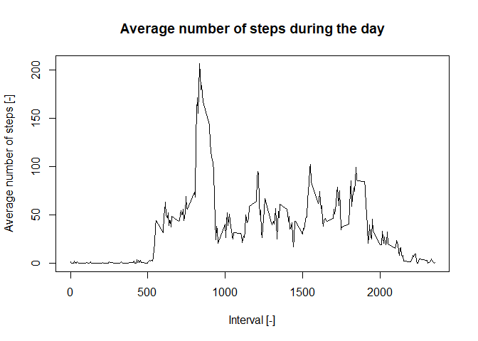

## Loading and preprocessing the data

In this section the data is loaded and the date variable is set as "date" format


```r
## Check if the data is already extracted, if not extract it
if (!file.exists("activity.csv")){
    unzip("activity.zip")
}

## Read the data
DT <- read.csv("activity.csv")

## Change the format of the date from string to date
DT$date <- as.Date(DT$date, format = "%Y-%m-%d")
```

The data set contains 17568 observations. 
There are 570608 steps from 2012-10-01 to 2012-11-30.

## What is mean total number of steps taken per day?

In this section the NA values are ignored. The histogram below shows the total number of steps
per day:


```r
## Calculate the total number of steps for each day
Stp <- with(DT, tapply(steps, date, sum, na.rm = TRUE))

hist(Stp, main = "Number of steps per day", xlab = "Total number of steps per day [-]")
```

<!-- -->

```r
## Calculate the mean and median of the total number of steps per day
mean_Stp <- mean(Stp, na.rm = TRUE)
median_Stp <- median(Stp, na.rm = TRUE)
```
The mean number of steps per day is **9354**.
The median number of steps per day is **10395**.

## What is the average daily activity pattern?

In this section we are interested in the pattern of steps throughout the day.
The program below is plotting this average pattern for a day. Note that the data 
is collected every 5 minutes. The program also computes the interval where the average number of steps is maximum.


```r
## Compute the average number of steps for every interval (5 min)
Stp_ave <- with(DT, tapply(steps, interval, mean, na.rm = TRUE))

## Plotting the time series of average steps during a day
plot(unique(DT$interval), Stp_ave, type = "l", xlab = "Interval [-]", ylab = "Average number of steps [-]",
     main = "Average number of steps during the day")
```

<!-- -->

```r
## Compute the 5-min interval containing the maximum average number of steps
Max_int <- unique(DT$interval)[which.max(Stp_ave)]
Max_stp <- max(Stp_ave)
```
The 5-min interval where the average number of steps is maximum during the day is **[835-840]** with 206.2 steps.

## Imputing missing values

In this section the missing values are taken into account. They are replaced by the average number of steps for the interval the data is missing.


```r
## Calculate the total number of NA values in the data set
NA_val <- sum(is.na(DT$steps))

## Find where NA values are occurring in the data set
NA_occ <- is.na(DT$steps)

## Create a new data set identical to the original but where the NA values will be replace
DT1 <- DT

## Create a vector same length of the data set with the average number of step per day
Dummy_stp <- rep(Stp_ave, length(unique(DT$date)))

## Replace NA values with the average number of steps for this interval
for (i in 1:length(NA_occ)){
    if (NA_occ[i] == TRUE) {
        DT1$steps [i] <- Dummy_stp[i]
    }
}

## Calculate the number of steps each day
Stp_new <- with(DT1, tapply(steps, date, sum))

## Make a histogram of the number of steps each day
hist(Stp_new, main = "Number of steps per day", xlab = "Total number of steps per day [-]")
```

<!-- -->

```r
## Calculate the mean and median number of steps per day as well as how much it changed compared to the initial values where NA values where ignored
mean_Stp_new <- mean(Stp_new)
median_Stp_new <- median(Stp_new)

PC_change_mean <- 100*((mean_Stp_new - mean_Stp)/mean_Stp)
PC_change_median <- 100*((median_Stp_new - median_Stp)/median_Stp)
```
There are **2304** observations with NA values for steps. This represents 13.1% of the rows in the data set.

The new mean value for the number of steps per day is 10766.2, compared to 9354.2 when missing values were ignored, this a change of **15.1%**.
The new median value for the number of steps per day is 10766.2, compared to 10395 when missing values were ignored, this a change of **3.6%**.

As a result, imputing the number of steps in the missing data set as changed the mean number of step per day significantly but the median has not changed much. The mean and the median have the same values after imputing the missing values.

## Are there differences in activity patterns between weekdays and weekends?

In this section we compare the average number of steps during the day between weekend and weekdays. The plot below shows the differences in pattern.


```r
# Define which days are weekdays and which days are weekend
daytype <- rep("weekday", length(DT1$date))
daytype[weekdays(DT1$date) == "Saturday" | weekdays(DT1$date) == "Sunday"] <- "weekend"

DT1$daytype <- daytype

## Calculate the average number of steps per interval in weekend and weekdays
DT2 <- aggregate(steps ~ interval + daytype, FUN = mean, data = DT1 )

## Plot the data
library(ggplot2)
qplot(interval, steps, data = DT2, color = daytype, geom  = "line") + facet_grid(DT2$daytype~.)+ labs(title = "Average number of Steps", x = "Interval [-]", y = "Number of steps [-]")
```

<!-- -->
